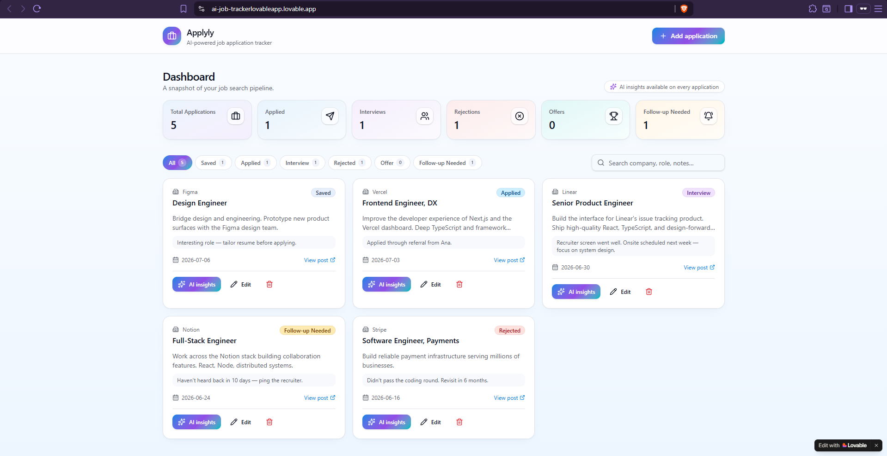
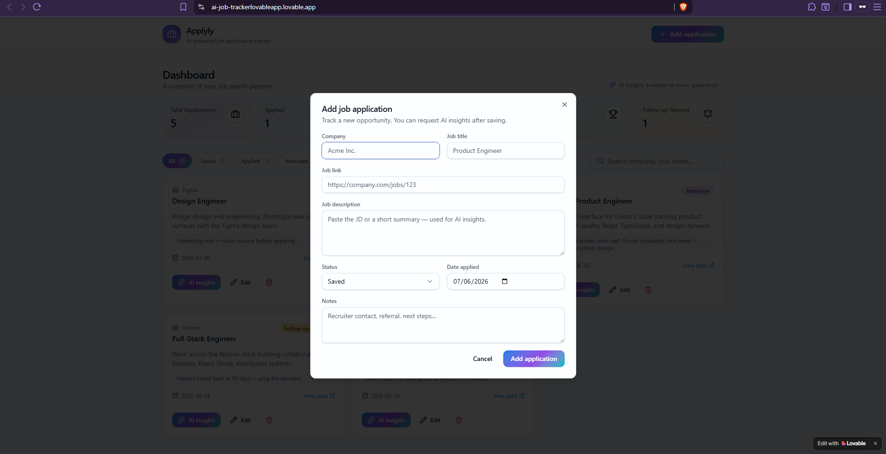
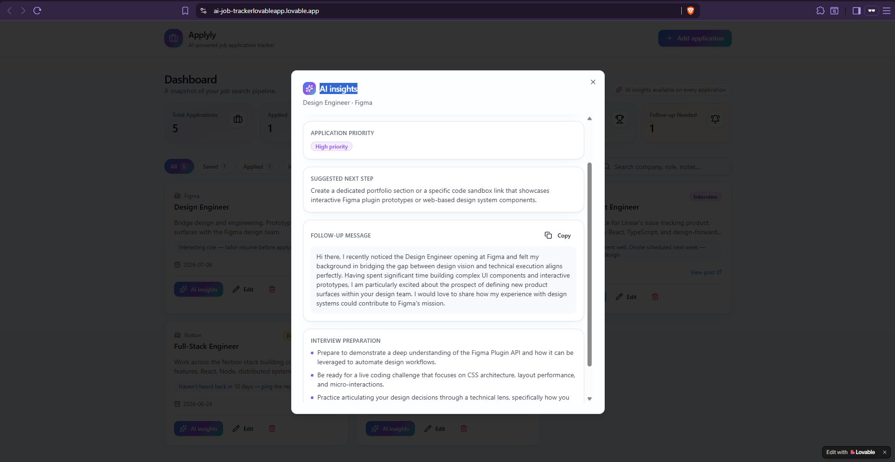

# Applyly – AI Job Application Tracker

AI-powered job application tracker that helps job seekers organize applications, monitor progress, generate AI insights, and prepare for interviews.

---

## 🚀 Live Demo

https://ai-job-trackerlovableapp.lovable.app/

---

## 📋 Overview

Applyly is an AI-powered application designed to help job seekers manage their job search more efficiently.

Instead of tracking applications in spreadsheets or notes, users can organize every opportunity in one place while receiving AI-generated recommendations throughout the hiring process.

---

## ✨ Features

- Add and manage job applications
- Track application status
- Search applications instantly
- AI Match Summary
- Application Priority
- Suggested Next Step
- AI-generated Follow-up Message
- Interview Preparation Tips
- Clean dashboard with application statistics

---

## 🛠 Tech Stack

- Lovable
- React
- TypeScript
- Tailwind CSS
- Supabase
- AI Prompt Engineering    
---

## 📸 Screenshots

## 📸 Dashboard

      

---

## 💡 Use Case

Applyly helps job seekers:

- Stay organized during their job search
- Track every application in one place
- Prepare for interviews
- Generate professional follow-up messages
- Prioritize the most promising opportunities

---

## 👨‍💻 Author

Daniel Paunovski

LinkedIn:
https://www.linkedin.com/in/daniel-paunovski-7ab25a12

GitHub:
https://github.com/PaunovskiD
